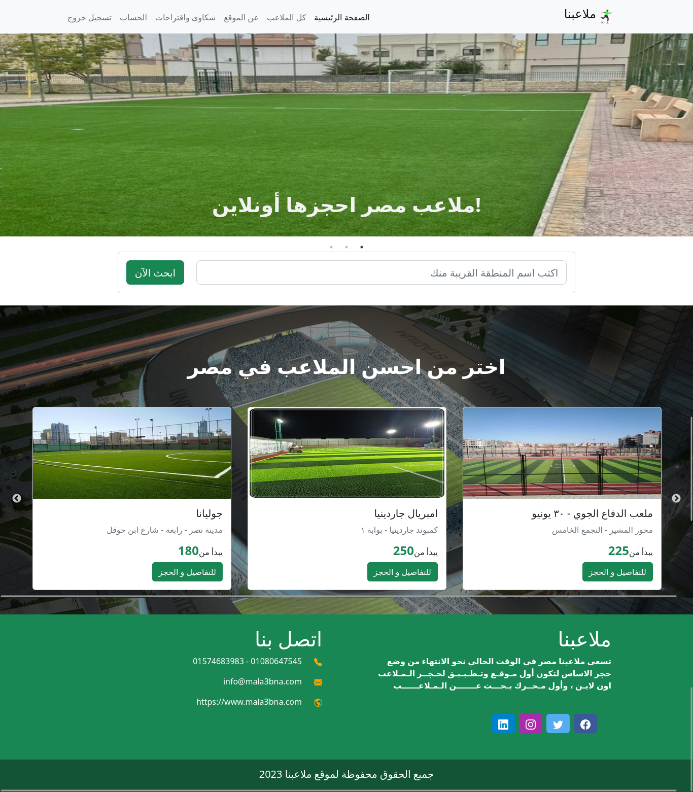
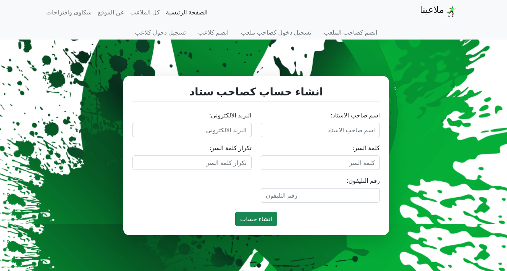

# Stadium Reservation Website
> This is a full-stack web application that allows players to reserve stadiums or playgrounds and enables stadium owners to add their stadiums and available hours.
> Live demo [_here_](https://stadiums-reservation-client-side.onrender.com/).

## Features
- User authentication and authorization system .
- Stadium owner dashboard to add and manage stadiums and hours .
- Player dashboard to book stadiums based on date, and time .
- Responsive design for optimal user experience on mobile devices .

## Technologies Used (MERN)

#### Front-end

- Front-end Framework: `React.js (with Reduxjs/tooltik , axios and React-Router-Dom)`
- Styling: `CSS` and `BOOTSTRAP`
- Component Packages using : `react-slick` and `react-awesome-slider`

#### Back-end

- For handling requests: `Node.js with Express.js Framework`
- As Database: `MySQL with Sequelize`
- API tested using: `POSTMAN`

## Screenshots

<!-- If you have screenshots you'd like to share, include them here. -->
